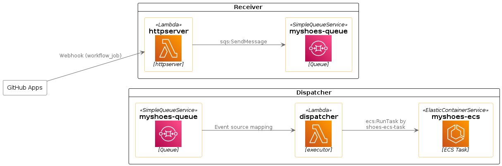

# myshoes-serverless-aws

Serverless implementation of [myshoes](https://github.com/whywaita/myshoes) on AWS.

myshoes provide auto-scaling and ephemeral self-hosted runner for GitHub Actions.

- datastore: Amazon SQS
- Stadium (for runner): Amazon ECS (use [shoes-ecs-task](https://github.com/whywaita/shoes-ecs-task)), But you can switch and develop yourself!



## Usage

```bash
$ cat run.sh
#!/bin/bash

# For myshoes-serverless-aws
export AWS_DEFAULT_REGION=us-east-1
export AWS_SQS_QUEUE_URL=https://sqs.us-east-1.amazonaws.com/${your account id}/myshoes-queue

# For shoes-ecs-task
export ECS_TASK_CLUSTER="myshoes"
export ECS_TASK_DEFINITION_ARN="arn:aws:ecs:us-east-1:${your account id}:task-definition/myshoes"
export ECS_TASK_SUBNET_ID="subnet-xxx"
export ECS_TASK_REGION="us-east-1"

## Optional
export ECS_TASK_NO_WAIT=true

./myshoes-serverless-aws
```

Please more details, see [examples/terraform](./examples/terraform).

## Motivation

The default version of myshoes was designed to be dependent on MySQL. While MySQL is robust and widely used, it comes with its own challenges, particularly in operation and maintenance. Ensuring its smooth operation often requires a substantial amount of effort and resources.
However, myshoes was always designed with flexibility in mind. It was built to allow for a switch in data stores, catering to its users' evolving needs and the tech landscape's dynamic nature. This inherent flexibility led us to rethink our approach and consider alternatives to MySQL.

As a result, we embarked on the journey to develop a serverless version of A. This version retains all the functionalities of the original myshoes, but without the operational burdens that come with managing a MySQL database. The shift to a serverless architecture not only simplifies the operation but also allows users to focus more on utilizing A's capabilities rather than its maintenance.

We believe this serverless version of A will be a significant step forward, providing a more efficient and less complex alternative to the original MySQL-dependent version.

## Acknowledgement

This provider was inspired by [the tech blog](https://techlife.cookpad.com/entry/2022/11/07/124025) by [Cookpad](https://github.com/cookpad). Thank you for your great work! 